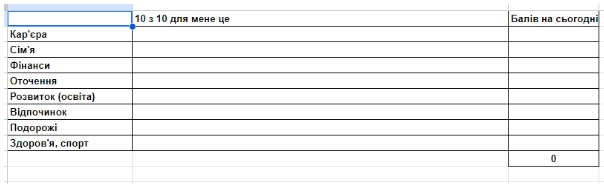
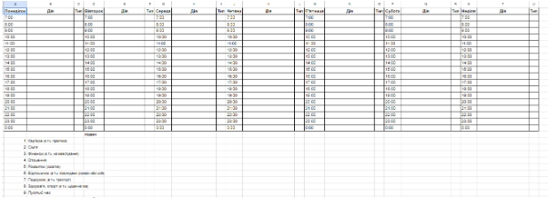
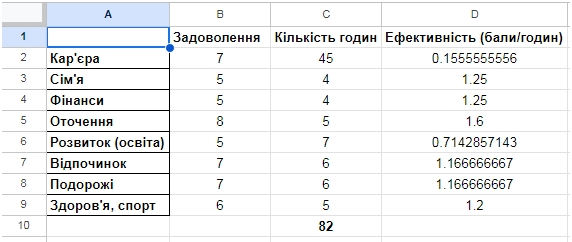

# Заняття 1. Самооцінка.
# Формування самооцінки

## Визначення самооцінки

**Самооцінка** – це важлива складова світосприйняття людини. Один трьох типів оцінки (дві інших – оцінка інших та оцінка світу). Передує практично всім діям людини, адже для того, щоб людині прийняти рішення щодо певних дій їй необхідно мати оцінку себе. Тобто **самооцінка** – це обов'язкова складова будь-яких дій та самопочуття людини.

**Сприйняття себе** (внутрішнє сприйняття) є основою для того, як людину сприймають інші (зовнішнє сприйняття), адже самосприйняття транслюється назовні мовою нашого тіла, інтонаціями, стилем мовлення, щодо певного питання.

При цьому найкраща оцінка – це **адекватна оцінка** , адже тоді вам можуть запропонувати таку пропозицію, яка підходить саме вам, або ж пристати на вашу пропозицію, адже ви її сформували зрозуміло та змогли показати її переваги.

**Завищена оцінка** себе буде вести людину до того, що до неї будуть завищені очікування, за якими будуть сформовані завищенні вимоги, які людина не зможете задовільнити, що, в результаті, призведе до невдоволення зовнішніх оцінювачів та, як наслідок, негативних наслідків.

Аналогічна ситуація із **заниженою самооцінкою** – вам буде складно сформулювати таку пропозицію, яка буде цікава саме вам (ви будете пропонувати умови більш цікаві іншим, ніж вам), що в результаті призведе до невдоволеності людини.

Підсумуємо. В питаннях самооцінки основною цінності є **адекватність самооцінки**. Тобто така оцінка себе, що відповідає дійсності. За умови побудови відповідної самооцінки людина зможе якісно представляти власні сильні сторони та ефективно працювати зі слабкими сторонами.

## Які є інструменти адекватної самооцінки.

Самооцінка формується, на джерелах інформації про себе. Всі джерела інформації про себе можна розділити на об'єктивні та суб'єктивні. Спиратися необхідно об'єктивні джерела, а за суб'єктивними джерелами можна перевіряти вже на адекватність тих суб'єктів, які є носіями точки зору, що не відповідає об'єктивним джерелам.

Які є об'єктивні джерела інформації? Це ті джерела, які не залежать від точки зору людей: переважно це ваші досягнення які цінні самі по собі, а також ваші навички, які підтверджуються виконанням вами певного обсягу робіт за визначений час із визначеною якістю.

В діловій практиці документом, що дозволяє описати такі результати **є резюме (****CV****)**. По суті – це перелік ваших попередніх досягнень у вигляді місць роботи за опису результатів, які ви досягли відповідних місцях роботи. При цьому важливі питання не того була це комерційна чи громадська діяльність а те, яких результатів ви досягли, тобто які ваші якості і навички були застосовані і до які результати вони дозволили досягнути.

Огляд того, чого ви досягли дозволяє вам розуміти, що ви вже вмієте. Наступним кроком до оцінки, не менш важливим в професійній сфері є те, що ви хочете отримати. Ви щось можете собі думати і про щось мріяти, але, як ми говорили вище – це суб'єктивне джерело інформації. Об'єктивним джерелом інформації в такому випадку буде опис вакансії на відповідному професійному сайті. Для українського ІТ таким сайтом є dou.ua

Коли ви визначили що ви вже вмієте, чого досягли та визначили те, чого бажаєте досягнути ви можете сформулювати перелік тих якостей, які ви маєте сформувати та тих навичок, які ви маєте отримати, щоб досягнути власну мету. Такий перелік, в якому проставлені строки можна назвати планом вашого особистого зростання або **індивідуальним планом розвитку**.

Індивідуальний план розвитку є важливою складовою персональної хартії навчання, що є результатом проходження даного курсу.

## Управління ресурсами.

Проте одного планування для досягнення цілей недостатньо, необхідно розподіляти ресурси, які є у користуванні людини на досягнення поставлених цілей.

При цьому у людини в управління є не так і багато ресурсів. Виділимо основні: мотивація, час, фінансовий потік та наявний капітал. Інформація стосовно наявного у людини професійного капіталу міститься в резюме, суспільного капіталу – в книзі контактів, фінансового капіталу – на банківському рахунку, о організаційного капіталі – в вашій команді. Проте мотивація, час та фінансовий потік – це ресурси, якщо їми правильно керувати дозволяють збільшувати накопичений капітал у будь-якій сфері.

Для роботи із кожним з цих ресурсів ми використаємо відповідні техніки. Для роботи із мотивацією – колесо життєвого балансу, для роботи із часом – розклад тижня, для роботи із фінансовим потоком – таблиця доходів та розходів.

## Колесо життєвого балансу

Методика запропонована Біллом Рейном, професором з університету Канади. Ми її візьмемо за основу, трохи пояснимо як вона працює та використаємо для оцінки рівня мотивації людини.

В самій методиці необхідно для 8 сфер: кар'єра, фінанси, сім'я, оточення, розвиток, відпочинок, хоббі, здоров'я. Розділення життя людини на певні сфери дозволяє забезпечити можливість аналізувати життя. Це відбувається через те, що людина за один погляд (фрейм) може сприйняти від 5 до 9 елементів. Для сприйняття більшої кількості елементів людська свідомість розділяє елементи на групи.

Саме тим, що ми в цій вправі даємо розділення життя на елементи – дозволяє сконцентруватися на конкретних бажаннях у відповідних елементах життя.

На відміну від класичної техніки колесо життєвого балансу ми пропонуємо вам скористатися такою, що її запропонував А.Чорний (Ph.D, в економіці, генеральний директор GoIT). Він запропонував до оцінки – продумати по кожному елементу, таке досягнення, яке б ви оцінили на 10 з 10.

А далі – оцініть той рівень здобутів, який є у вас на сьогодні.

## Сфери життя
Для кожної сфери життя важливо мати визначення:
* **Кар'єра** - частина вашого життя яка створює для вас нові можливості та задовільняє ваші потреби в статусі, зв'язках, соціальних та інших атрибутах. Дуже часто - дії, що спрямовані на формування кар'єри не сприяють досягненню фінансових цілей. Саме тому важливо узгоджувати ці сфери власного життя. Якщо узагальнити, то можна сказати, що це сфера самореалізації людини.
  
* **Сім'я** - це сфера близьких взаємин, часто повсякденних взаємин, учасників яких обираєте ви. Навіть якщо це ваші родичі - ви самі вирішуєте - чи є вони вашою сім'єю.

* **Фінанси** - це сфера життя, результатом якої є ваші гроші. Тобто це дії, що спрямовані на отримання, ефективний розподіл за збільшення фінансів, що є у вашій власності.
  
* **Оточення** - це сфера взаємин, із тими хто вас оточує і взаємодія із цими людьми зумовлена реалізацією вами інших цілей: кар'єра, відпочинок, фінанси, тощо. 

* **Розвиток (освіта)** - сфера збільшення ваших здібностей та/або можливостей: коли ви здобуваєте нові навички, або формуєте нові якості.

* **Відпочинок** - сфера збільшення життєвих сил, або зменшення рівня стресу. До цієї сфери входить в тому числі перегляд відео, прогулки, відвідування мальовничих місць, медитації, тощо.

* **Подорожі** - це сфера знайомства із новим: новими країнами, містами, людьми. Історично, це відбувається в результаті подорожей, проте сьогодні для знайомства із новими людьми можна відвідати діловий захід он-лайн, що по-суті є відповідником подорожі.

* **Здоров'я, спорт** - це сфера вашого фізичного розвитку та турботи за власним тілом, в тому числі - фізичні вправи, здорове харчування, відвідування лікарів, профілактика хвороб. Можна узагальнити цю сферу як "Здоровий спосіб життя".

### Завдання 1.
Підберіть зображення, які відображають ваші цілі.
### Завдання 2.
Візьміть [заготовки для створення карток](https://github.com/mikh-maksi/probes/tree/main/scheme/fe)  та адаптуйте її під відображення цілей (як заголовки візьміть назви цілей, ваші формулювання підставте як текст, а також використайте картинки, які ви підібрали). Як звіт з результату - зробіть скріншот, який не дозволяє прочитати формулювання цілей, якщо вам не хочеть розкривати їх.

## Як оцінити справжню цінність сфери життя.

Це завдання необхідно як для того, щоб почату управляти власним часом, так і для того, щоб оцінити на скільки реально (а не за вашим враженням) є для вас цінною та чи інша сфера вашого життя. Такий висновок можна зробити, якщо прийняти припущення, що ми більше вкладаємо часу в ту сферу, що є для нас найціннішою.

Відповідно до цього, якщо ви зможете визначити скільки часу у вас займає та чи інша дія та до якого напрямку вашої діяльності вона відноситься ви зможете визначити, на скільки вона для вас цінна, сприаючись на об'єм ваших дій для її досягнення.

Як ми вже описали вище, кількість часу що ви його виділяєте на дії за сферами діяльності відповідає тому на скільки для вас цінна та чи інша сфера. Ваша ефективність визначається тим, яких результатів ви досягаєте за виділений час. Таку ефективність можна визначити, отримавши результат ділення рівня вашого задоволення сферою на кількість годин, які ви вкладаєте в цю сферу. 

Ефективність ваших дій та узгодження ваших думок про себе та дій ведуть до зростання задоволеності від життя. 

Для оцінки розподілу часу необхідно позначити те, як проходить ваш тиждень – на що саме ви витрачаєте час. А далі – позначити до якої категорії життя, що відповідають побудованому вже колесу бажань відноситься та чи інша дія.

В результаті побудови такого розкладу:

- ви зможете знайти той час в своєму тижні, який не є продуктивним і наповнити його змістом.
- Ви зможете оцінити на які напрямки ви виділяєте свій час і подивитись на те, на скільки такий розподіл відповідає вашому колесу життєвого балансу.
- Зможете вирахувати на скільки ви ефективно працюєте в кожній зі сфер. Для цього бал, який ви собі поставили у вправі «колесо життєвого балансу» у відповідній сфері поділіть на кількість годин, яку ви витрачаєте на цю сферу. В результаті ви зможете порівняти різні сфери по тому, на скільки просто вам вдається отримувати задоволеність в кожній з них.

## Тижневий баланс доходів та розходів.

В цій вправі першим сформуйте тижневий план розходів – на що ви витрачаєте гроші. А далі – визначте до якої категорії життя відносяться дані розходи. Тут варто проявити глибинне розуміння, що будь-які розходи наближають вас до мети лише за умови свідомого їх витрачання: витрати на транспорт вам економлять час на пересування (бо інакше довелося б йти пішки), витрати на їжу – створюють умову для вашої активної діяльності та здоров'я (адже без їжі не буде й активності не буде й здоров'я).

На сформований образ життя вам необхідний відповідний рівень доходів, що забезпечує існуючий потік розходів. Які ваші джерела доходів? На скільки вони відповідають вашим розходам? Що вам необхідно зробити, щоб збільшити рівень доходів? На скільки ви його хочете збільшити? Відповіді на ці питання будуть знайдені вами набагато швидше та адекватніше після виконання вправ на облік ваших розходів.

## Вартість часу

Виконання завдання облік часу та на облік доходів дозволяє вирахувати дуже важливий показник – вартість вашого часу (timerate). Тобто те, за яку суму ви працюєте. Дана цифра дозволить привести витрати двох основних ресурсів (часу та грошей) до загального знаменника: або перевести весь час в гроші, або гроші перевести в години.

Якщо ви не працюєте – візьміть мінімальний рівень оплати праці, дозволений в країні.

Тоді можна. більш точно порахувати ефективність досягнення цілей по кожній категорії життя.

Тобто, якщо ціна вашої години 20 євро, а за 15 євро ви можете проїхати на таксі дорогу від вокзалу за 15 хвилин, тоді як на громадському транспорті ви будете їхати безкоштовно, але 1 годину 15 хвилин, то такі витрати для вас будуть вигідними.

І це дозволить вам правильно розподіляти ваші ресурси: за гроші отримувати більше часу, щоб із використанням часу отримувати більше грошей, або більш швидше досягнення цілей по інших категоріях життя.

Це об'єктивні джерела інформації, які дозволяють сформувати якісну самооцінку.

## Завдання:

- Виконайте вправу «Колесо життєвого балансу»
- Виконайте вправу «Розклад тижня»
- Виконайте вправу «Баланс доходів і розходів за тиждень»
- Визначте вартість вашого часу.
- Визначте затрати часу, грошей, та часу та грошей на отримання 1 балу оцінки за кожною категорією життя.
- В якій з категорій вашого життя ви б хотіли впровадити зміни?

Приклад реалізації завдання в <a href = "https://docs.google.com/spreadsheets/d/1TyLuzQhpHJyH4jCtp6l-0VgMuSb-I5QLfdztmdlMTyo/edit">google.drive</a>

